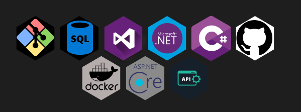

# Hi, I'm Max.
[![Linked In][linkedin-shield]](https://www.linkedin.com/in/devmaxdaniel)
## About me

I'm Brazilian, currently a software engineering student, and aspiring in the technology field since 2015, during this time I worked on several personal projects, but only in 2022 did I decide to take this up as a profession, specifically as a **back-end.**

👾 where I focused my work and study on the C# language and the .NET platform.

In my opinion, the best project ever to develop is always the next one. I love challenges, learning new skills and programming languages. I beleiebe that there is always spare to improve ourselves.

[Linkedin-shield]: https://img.shields.io/badge/LinkedIn-074F97?&style=for-the-badge&logo=LinkedIn&logoColor=white
